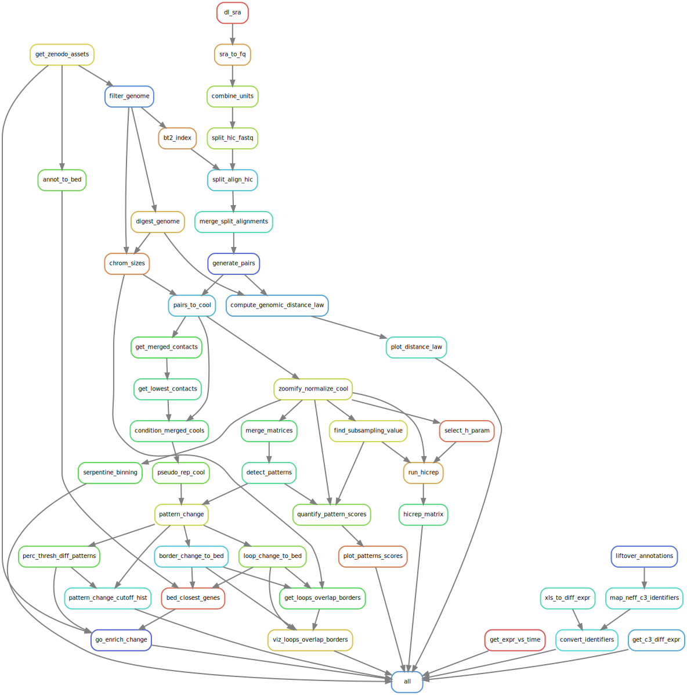

# Genomic changes during infection of amoeba by _L. pneumophila_

## Background

This repository contains the analysis of _Acanthamoeba castellanii_ infection by Legionella pneumophila.
We investigate how the host genome is remodelled during infection by an intracellular infection. To investigate these changes, we use Hi-C and RNAseq to measure both 3D changes in chromatin and gene expression changes. We use two biological replicates of uninfected _A. castellanii_ (strain C3) and two infected replicates at 5h post infection.

## Installation

In order to rerun the whole processing pipeline, you need to: \

* download required fastq files and put them in the fq folder
* download the input archive and extract it into `data/input`

The processing pipeline is written using snakemake and relies on conda to manage dependencies. You need to have a working conda installation on your machine and install snakemake via pip or conda.

You can then run the pipeline with:

```sh
snakemake -j6 --use-conda
```
And the pipeline should fetch required packages as it runs.

## Configuration

Some metadata files are provided with the pipeline to help understand the design and modify parameters. The following files may be of interest:

* `samples.tsv`: Samples used in analyses and associated informations
* `units.tsv`: sequencing libraries used in the pipeline, file paths for the reads and metadata
* `config.yaml`: path to key files and general parameters to control results of the pipeline.
* `cluster_slurm.json`: Cluster resource requirements in the event that the pipeline is run on a HPC with the SLURM scheduler. In that case, the following command should be used to run the pipeline instead:
  + snakemake --rerun-incomplete --use-conda --cluster-config cluster_slurm.json --cluster "sbatch -n {cluster.ntasks} -c {cluster.ncpus} --mem {cluster.mem} --qos {cluster.queue}" --jobs 30

## Pipeline

The pipeline is subdivided into submodules relating to the processing and downstream analysis of Hi-C and RNAseq data. It starts from fastq files to generate Hi-C matrices and differential expression results. It also computes statistics and does pattern detection on Hi-C contact map to generate figures and tables which will be used by tailored analyses in jupyter notebooks.

Here is a visual summary of pipeline steps and their dependencies:



For a more detailed visual summary showing input/output files, see the [filegraph](docs/img/filegraph.svg)

## Analyses

Analyses are described in jupyter notebooks located in the `docs/notebooks` folder. These notebooks are numbered to reflect the logical order in which analyses should be done. They should be executed in that order as some will generate files for the next notebook.

